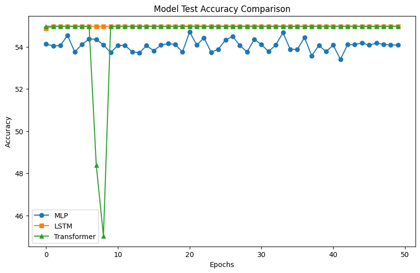

# Optimization Techniques for t-SNE Visualizations

## Project Overview

This project explores ML and Mathematical based optimization techniques for improving the performance and reliability of t-SNE (t-distributed Stochastic Neighbor Embedding), a popular method for dimensionality reduction. The study focuses on addressing the limitations of t-SNE, particularly its sensitivity to initialization and the challenges in preserving global data structure.

## Table of Contents

1. [Introduction](#introduction)
2. [Some Known Improvements and Techniques](#improvements-and-techniques)
3. [Experiments and Results](#experiments-and-results)
4. [Conclusion](#conclusion)
5. [How to Use](#how-to-use)
6. [Contributors](#contributors) 
## Introduction

Dimensionality reduction is crucial for visualizing and interpreting high-dimensional data. While methods like PCA and UMAP are widely used, t-SNE offers unique benefits in preserving local structure.

## Some Known Improvements and Techniques

Several methods were explored to enhance the performance of t-SNE:

- **Momentum and Adaptive Learning Rates**: To stabilize and accelerate convergence.
- **Early Compression and Exaggeration**: To enhance the separability of clusters.
- **Noise Contrastive Estimation (NCE)**: Reformulating the objective function for better optimization.

## Experiments and Results

Experiments were conducted using synthetic datasets like circles, blobs, and clusters. The performance of various models was compared, highlighting the hardness of learning the landscape.

## Conclusion

Despite improvements, the project identifies that t-SNE's sensitivity to initial conditions and difficulty in learning complex landscapes remain significant challenges. Future work will explore alternative optimization strategies.

## How to Use

1. **Installation**: Create a new environment using the specifications file given.
2. **Data**: Data generation notebooks included. Data might be uploaded to external database.
3. **Running the Code**: For replecating the results shown in graphs, please download desired data files and change classifier.py files' path accordingly. 

## Contributors

- **Liam Brinker** - Project Lead
- **Prof. Ofra Amir** - Supervisor
- **Dr. Nir Rosenfeld** - Supervisor

